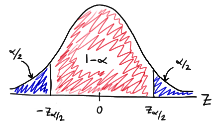

这篇笔记是根据[网上课程](https://onlinecourses.science.psu.edu/stat414/node/289/)所做的归纳总结。

## 估计 estimation

统计的第一个常见的问题是，我们往往想知道一个被研究的总体的某个参数，比如中国男人的平均身高，但是实际情况下是不可能得到所有男性的身高，所以一般的做法是随机抽取一部分样本，并将样本的平均身高作为总体的平均身高的估计量。因此我们对整体的某个指标的认识很大程度上就取决于我们选取的样本，以及选取的对应的估计量。举个例子，如果我们选取的样本恰好身高都比较低，平均身高只有只有160， 那么按照理论我们就要认为中国男性的平均身高就只有160吗？ 这显然是不合理的所有我们在选取样本的时候一定要遵循随机的原则，而且数据量要尽可能大，这里的大是个相对概念，具体取决于总体的量是多大。另外一个问题是，我们在做估计的时候，单单提供一个数值是不准确的，因为不管怎样随机，我们都不可能得到总体的实际情况，一个比较合理的做法是给出一个区间也就是常说的置信区间和一个概率值也就是置信度p，我们就可以说，我们有p的自信相信，总体的某个指标落在置信区间内。

那么在这节课里面我们要学习的内容是对于一个未知的系统参数如何找打一个好的估计量，什么是好的估计量呢，其实就是常说的无偏估计量，无偏值得是估计量的平均值和被估计的总体参数是一致的，后面会有例子演示如何判断。具体来说有两种判断方法，一个是最大似然估计，一个是矩估计。

### 最大似然估计

假设我们现在有一个随机样本$X_1, X_2, \ldots,
X_n$，假设在基于某位置参数的情况下我们已经知道这些随机变量的分布，现在的问题就是，如何根据“观测值”$x_1, x_2, \ldots, \x_n$来找一个好的“估计量”。

最大似然估计定义“好的”的意思就是使观测值出现的概率最大。在知道随机变量的分布的情况下这也很好计算，只需要求出联合概率并求使概率最大的位置参数$\theta$即可。一般可通过求导或者求偏导数解决。

### 无偏估计

前面已经说过，衡量一个估计量是否是“好的”的标注是是否无偏。也就是估计量的均值是否和为止参数一致。举个例子，对于服从伯努利分布的随机变量$X_i$样本，用最大似然估计求得的对参数p的估计量是：

$$
\hat{p} = \frac{1}{n} \sum_{i=1}^{n} X_i
$$

而：

$$
E(\hat{p})=E(\frac{1}{n} \sum_{i=1}^{n} X_i)=\frac{1}{n} \sum_{i=1}^{n} E(X_i)=\frac{1}{n} \sum_{i=1}^{n} p = \frac{1}{n} (np) = p
$$

说明最大似然估计求得的估计量是无偏估计量。

对于用最大似然估计求得的正态分布的随机样本的均值和方差的估计量是否是无偏估计也可以用类似方法验证

但是有时候根据最大似然法是不可能得到一个比较方便的形式的估计量，这时候可以用数值方法近求得估计量的近似值。另外一种方法就是用矩估计的方法。

### 矩估计

“矩”分为两种，一种是原点矩，一种是中心矩。这里以原点矩为例。所谓矩估计就是将各阶样本矩和随机变量理论分布的的矩等同起来，列出n个等式，知道能够解出未知参数的估计量。

对于随机变量分布

+ k阶原点矩的定义是：$ E(X^k) $
+ k阶中心距的定义是：$ E[(X - \mu)^k] $

而对于样本

+ k阶原点矩的定义是 $ M_k = \frac{1}{n} \sum_{i=1}{n} X_i^{k} $
+ k阶中心距的定义是 $  M_k = \frac{1}{n} \sum_{i=1}{n} (X_i - \bar{X})^{k} $ 

一个典型的例子是对于服从正态分布的随机变量$X_1, X_2, \ldots,
X_n$，需要估计的位置的参数是均值$\mu$和方差$\sigma^{2}$，

正态分布的一阶和二阶原点矩很容易求得，分别是$E(X_i) = \mu$和$E(X_{i}^{2}) =
\sigma^{2} + \mu^{2}$

按照矩估计的方法，我们可以列出两个等式：

+ $ \mu = M_k = \frac{1}{n} \sum_{i=1}{n} X_i $
+ $ \mu^{2} = M_k = \frac{1}{n} \sum_{i=1}{n} X_i^{2} $

从等式中可以解出$ \hat{\mu_{MM}} = \bar{X} = M_k = \frac{1}{n} \sum_{i=1}{n} X_i $, $ \hat{\sigma_{MM}^{2}} =  M_k = \frac{1}{n} \sum_{i=1}{n} (X_i - \bar{X})^{2} $

这里是以原点矩为例，中心距的做法类似。

## 单个均值的置信区间

前面已经提到过置信区间，这一节主要介绍如何计算单个均值的置信区间，首先考察一个不切实际的情况，即假设事先知道随机变量分布的方差（求得的置信区间叫做z-interval），然后再考察事先知道均值的情况（求得的置信区间叫做t-interval）。

在介绍这两种情况之前，我们先来从统计学上的来理解一下置信度的概念。比如置信度是$1-\alpha$， 我们不能理解成被估计量有$1-\alpha$的概率在得到的置信区间内，而是，假设我们取了足够多的样本，得到足够多的置信区间，有$1-\alpha$的置信区间是包含被估计量的。

然后来看第一种情况。

### 已知随机变量分布方差

假设：

+ $X_1, X_2, \ldots, X_n$是一组随机样本，每个随机变量都服从正态分布，分布的均值和方差分别是$\mu$和$\sigma^{2}$。那么有：
    $$
        \bar{X} \sim N(\mu, \frac{\sigma^{2}}{n}) 
    $$

    $$
        X=\frac{\hat{X} - \mu}{\sigma / \sqrt{n}} \sim N(0, 1)
    $$
    那么我们就有(1-\alpha)100%的自信确定分布的均值一定在$\hat{x} \pm z_{\alpha
    / 2 (\frac{\sigma}{\sqrt{n}})}$

    其中的$z_{\alpha / 2}$的含义如下图：

    

### 已知随机变量分布的均值

第一种情况有几个局限是：

+ 只知道方差而不知道均值是不太显示的情况，反之，显示情况是只知道均值而不知道方差。
+
我们得出的结论都是基于随机变量都是正态分布的假设的，但是现实情况是随机变量不是正太分布的。

### 置信区间的长度

很明显，在置信度比较搞的情况下，给出的置信区间的长度是越窄越有参考意义。从之前的表达式可以得到，置信区间的长度L是：

$$
L = 2 z_{\alpha / 2}(\frac{\sigma}{\sqrt{n}})
$$

方差是不可控的，所以要减小置信区间的长度，我们可以适当增加样本数量和减小置信度，这也是为什么我们通常选取95%作为置信度去求置信区间。

